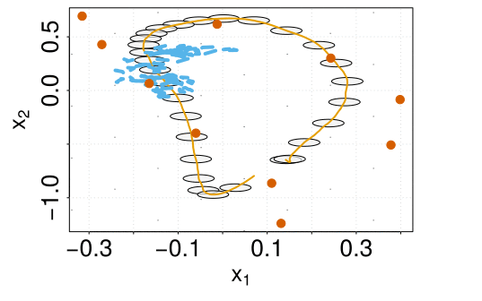
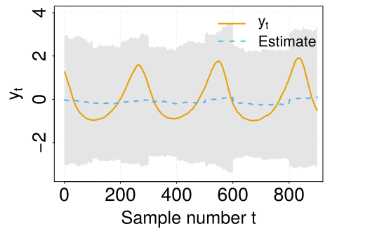
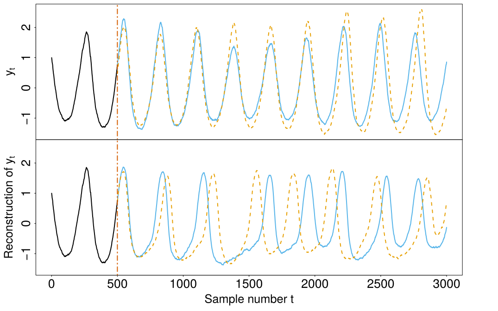

# Vaele
This code implements a Variational AutoEncoder (VAE) that permits to find a latent
space described by Stochastic Differential Equations (SDE, also known as 
Langevin equations) able to describe the rich dynamics of complex time series.
Note that this enables to find Markovian representations of time series with 
memory. 

This work was developed as part of my thesis, which my be found [here]() 
(TODO: link not working since the thesis has not yet been made public).

## Getting started
To analyze a new time series you must save your data as a CSV file in the 
`data` folder. Each row should represent a temporal instant, whereas each
column should represent each of the variables of your time series. 

Then, you must create an `Experiment` in the experiment folder. This is used
for tuning the some of the parameters of the experiment. See 
`lotka_volterra` for a self-contained example. The most important 
parameters are the embedding dimension (`embedding_dim`, the dimension
of the latent space to be discovered) and the name of the time series 
(`ts_id`, which should match the name of the CSV file).

The latent space and the SDEs describing its dynamical features are learnt
running the `run_experiment.py` script. The experiment to be run is loaded
in the import section of the code, i.e:

```python
# Load the experiment
from experiments.lotka_volterra.experiment import experiment
# ...
```
Note that the `run_experiment.py` code also contains a configuration section,
used during the development of this project for quick and dirty experiments.
Most of these parameters are related either to saving options or to hyperparameters
of the algorithm. Both will be removed in future versions.

The variational autoencoder and the results of the inference procedure are
stored in the `results` folder.

### An example: the Lotka-Volterra stochastic model
In this example, we illustrate the use of the SDE-based VAE to a 
nonlinear stochastic model inspired by the Lotka-Volterra equations. 
These equations are used in the study of biological ecosystems
to describe the interactions between a predator and its prey.


The next Gif shows the evolution of the latent phase space after 1, 10,
25, 55 and 450 iterations. The mean and covariances of the encoding network
are represented by orange lines and gray ellipses, respectively. A single 
illustrative sample of the phase space is shown with a dashed blue line. 
Finally, the inducing-inputs are represented with reddish points, whereas 
the drift is represented by arrows. Note that the latent phase space quickly
captures the oscillatory nature of the Lotka-Volterra model. 

<p align="center">

</p>


From this latent phase space, is possible to reproduce the exact time series
that feeds the training of the VAE. During the training process, the decoder
tries to reproduce as exactly as possible the input time series, driving the
optimization process of the net. This is illustrated by the next Gif:

<p align="center">

</p>


Once the VAE has finished its training, it may be used for generating new
synthetic samples, as illustrated below. The top panel
shows real data generated from a Lotka-Volterra model. Since the model is 
stochastic, two different realizations are shown. The bottom panel shows 
two synthetic time series (blue and orange) generated by the SVAE given the
data up to the vertical line, colored in black.

<p align="center">

</p>

## A note about the dependencies
This code was developed using Python 3 and TensorFlow 1.X, which may yield
warnings due to methods been deprecated in TensorFlow 2.0.

